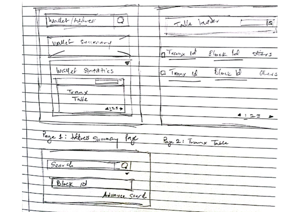
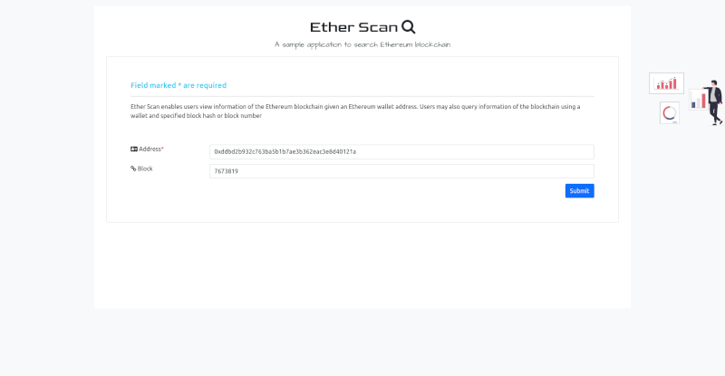

# TraceLabs Ether Scan

This application is a test by Aniefiok Friday, designed and implemented in partial fulfilment of career development at TraceLabs.

Ether Scan is a prototype search application that scans the Ethereum blockchain for transaction history and associated block data. 

## About Ether Scan

The application was built using web services of [etherscan.io](https://etherscan.io/apis),  
[BlockCypher Ethereum API](https://www.blockcypher.com/dev/ethereum/#introduction), and [CryptoCompare](https://min-api.cryptocompare.com). 
Queries relating to the blockchain are performed using the [etherscan.io](https://etherscan.io/apis) or [BlockCypher](https://www.blockcypher.com/dev/ethereum/#introduction). Queries for block and transaction are retrieved using the 
[BlockCypher Ethereum API](https://www.blockcypher.com/dev/ethereum/#introduction) API as this provides detailed information for a free API package. Alternate implementation using [etherscan.io](https://etherscan.io/apis) was also implemented. At the time of writing, both the [etherscan.io](https://etherscan.io/apis) and the [BlockCypher](https://www.blockcypher.com/dev/ethereum/#introduction) web services provide selected information on the Ether token (for both mainnet and testnets) but no free support for other ERC-20, ERC-721 (NFT), and ERC-1155 tokens. 

**Figure 1:** Wireframe of the Ether Scan web page

**Figure 2:** Screenshot of the designed Home page

## Prerequisites

The application was built using Python, HTML5, CSS and JavaScript. Application development and testing were done using a Lenovo Desktop with XP Xeon Processor and running Ubuntu Operating System. Below are the minimum requirements.

RAM - 4GB 

CPU - 2.0GHz or suitable to run [Uvicorn](https://www.uvicorn.org/) server.

The following Python environment requirements are needed to run the application.

+ [Python 3.x](https://docs.python.org/)
+ [FastAPI](https://fastapi.tiangolo.com/)
+ [Uvicorn](https://www.uvicorn.org/)
+ [aiohttp](https://pypi.org/project/aiohttp/)
+ [aiofiles](https://pypi.org/project/aiofiles/)
+ [requests](https://docs.python-requests.org/)

## Installation

The Ether Scan application source code can be downloaded from the GitLab repository: [tracelabs_etherscan](https://gitlab.com/frier17/tracelabs_ether_scan) for persons with appropriate permission.

### Installation Steps

1. To install and run the application, download the source file to a target directory. 
2. From the command line, launch the Uvicorn server using the command:

`$ uvicorn <target_directory>.ether_scan.router:app --reload`

Where the target_directory references the root directory of the local install.
The above command should start the local server install running the application through the `router.py` module.

Alternatively, change your working directory from the command line to the installation  directory and run the command

`$ uvicorn ether_scan.router:app --reload`

## Running Tests

The unit test was implemented for the backend services to cover selected application tasks, for example, fetching block data information via an API. All application tests are defined in the tests.py module. This can be run or executed from the command line or using a suitable testing framework like [pytest](https://docs.pytest.org/en/7.1.x). 

## Application Build

The current application build is categorized into two main sections: backend development and frontend development.

### Backend Development

All operations or services executed from the application server are categorized as backend development tasks. These tasks were programmed in Python programming language using the FastAPI web framework. As no data was stored in a database (this was considered out of the scope of the task), database integration using a suitable Object Relational Mapper (ORM) was excluded. The directory structure for the application is shown below:

The core operations covered by the backend development included:

+ Process application HTTP request calls. This was achieved running the prototype on the Uvicorn server listening to port 8000 (http://localhost:8000/)
+ Fetch blockchain data from the Ethereum network. This was achieved by using the BlockCypher API services and etherscan.io API services. All block or wallet information is retrieved from the respective API endpoints and then further processed. Information processing was achieved by using functions in the router.py module. Below is a short description of the functions and their role.

#### Backend functions

+ `fetch_address_data` makes a REST API call to get data associated with a given address. This function uses the BlockCypher API to retrieve blockchain data including a list of transactions of the given address or wallet. The address data and transaction list are returned as a dictionary.

+ `fetch_address_txlist` makes a REST API call to get data and transaction list associated with a given address through etherscan.io API. At the time of writing, only the free API package was used with limitations. For example, a full list of Ethereum based tokens cannot be retrieved using the free package at the time of writing. The address data and transaction list are returned as a dictionary.

+ `fetch_transaction_data` retrieves the detail of a transaction from the Ethereum blockchain using the transaction hash. This function returns the transaction data as a dictionary.

+ `fetch_block_data` retrieves the detail of a block on Ethereum blockchain using the block hash, block height or block number. This function returns the transaction data as a dictionary.

+ `fetch_current_price` retrieves the current USD or specified currency value of Ethereum using the CryptoCompare API endpoint. The current build allows for conversion to US Dollar (USD), Euros (EUR), Hong Kong Dollar (HKD), Japanese Yen (YEN), and Nigerian Naira (NGN). However, the current user interface does not allow for selecting multiple or any fiat currency despite the backend support for this feature. Implementing a full conversion system was considered out of scope and hence a default currency (USD) was adopted for demonstration purposes. This function returns the transaction data as a dictionary.

+ `generate_tnx_monetary_data` parses a given dictionary of transaction data into a format with keys and values for financial data. Tokens values sent or received are used to generate equivalent monetary data for the current date. All price conversions are done using the CryptoCompare API.

+ `generate_addr_monetary_data` parses a given dictionary of address data into a format with keys and values for financial data. Tokens values associated with address are used to generate equivalent monetary data for the current date. All price conversions are done using the CryptoCompare API.

+ `fetch_historic_price` retrieves the Closed; an average of the Mid, High, Low; total Volume from, and Volume to information of a currency trading pair of ether and selected fiat currency using the CryptoCompare API endpoint. This is a utility function and is currently not used by current application features.

The routing function on the router.py module includes:

+ `home` directs all HTTP GET Requests to the application home page.

+ `scan_wallet` handles only HTTP POST Requests to the application for querying Ethereum blockchain using BlockCypher. Posted data must have fields for `address` and `block` which are string fields that identify a wallet and a block.

+ `scan_wallet_by_block` handles only HTTP POST Request to the application for querying Ethereum blockchain using etherscan.io.

### Frontend Development

The application User Interface was implemented using HTML5, CSS3, and JavaScript using Bootstrap CSS framework and JavaScript plugins. A full JavaScript framework such as VueJS or React was not used for this Single Page Application as the number of components could be easily achieved via vanilla JavaScript or using lightweight frameworks or plugins such as jQuery. The current build uses the following JavaScript and CSS plugins.

+ [Bootstrap 5](https://getbootstrap.com/docs/5.1/getting-started/introduction/)
+ [jQuery](https://jquery.com/)
+ [DataTable](https://datatables.net/)
+ [Axios](https://axios-http.com/docs/intro)
+ [Font Awesome](https://fontawesome.com/v4/icons)
+ [Hight chart](https://www.highcharts.com/) 

## Acknowledgements

Special thanks to the TraceLabs HR or Recruitment team which offered an opportunity for me to design and implement this prototype in partial fulfilment of career development in the blockchain technology industry.

## Current Limitations

The current build of the Ether Scan application has the following limitations:
+ Users can only search for one address data with or without a specified block per time. 
+ The current build does not support resetting or clearing of the search form and also the result table. To clear existing records, users will need to refresh the web page. To resolve this in future builds, a RESET button can be used. Alternatively, event listeners on the form can be used to update the form and result where the values of the address or block are changed.

## Future Works

The Ether Scan application was built using a combination of technology and tools. A limited set of features were supported given the time constraint and specified scope. For possible future development, a mobile and web application could be implemented to help address selected usability and financial concerns of users when using cryptocurrency as a medium of trade or financial instruments. As an example, a report of the transaction patterns of a given wallet could be helpful in providing investment tips for users. Also, displaying historic values of tokens can help users appreciate overall financial transactions on a given wallet. Possible future works will consider addressing usability concerns on reporting blockchain transactions with everyday financial use cases like making payments for goods and services and getting a receipt using Ethereum or derivative tokens.
